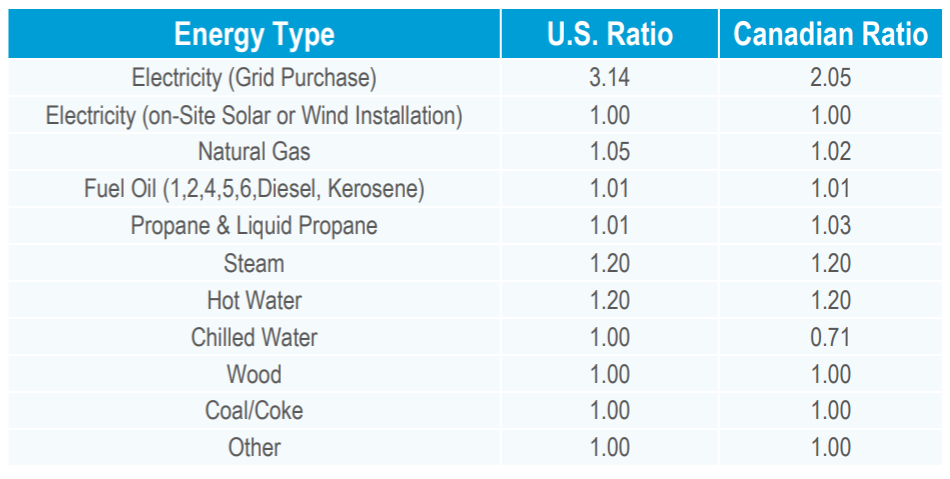

```{r setup, include=FALSE}
knitr::opts_chunk$set(echo = TRUE, warning = FALSE, message = FALSE, comment = NA)
```

# Background
On December 28, 2012, New York Governor Andrew Cuomo issued [Executive Order 88](http://www.governor.ny.gov/news/no-88-directing-state-agencies-and-authorities-improve-energy-efficiency-state-buildings) requiring that

  > By April 1, 2020 ... State Entities shall collectively reduce the average EUI [Energy Use Intensity] ... by at least 20% from a baseline of the average EUI ... for State fiscal year 2010/2011

The [New York Power Authority](https://www.nypa.gov) (NYPA) was charged with establishing a management and implementation team to administer the executive order, directed to ensure agencies' compliance by implementing reporting requirements to document progress toward the target.  In order to track performance against baselines, NYPA's [BuildSmart NY](https://www.nypa.gov/innovation/programs/buildsmart-ny) team collects utility bill information for all fuels (e.g. electricity, natural gas, and water) for all covered facilities as compared to the square footage of each facility.  This information is reported by each agency and submitted to NYPA in the form of an Excel spreadsheet template.  


## Challenges
Agencies are responsible for performing their own data validation --- the performance of this task has proved incomplete.  Many facilities have missing data for the baseline year, as well as showing large spikes or dips in reported usage believed to be due to data entry errors.  NYPA must ensure accurate data is used for the establishment of baselines and the tracking and reporting of performance.

EO88 reporting data has been hosted by a software vendor responsible for the the creation and maintenance of NYPA's [New York Energy Manager](https://www.nypa.gov/services/digital-energy-services/ny-energy-manager) (NYEM) platform.  The current structure of the data provides a great deal of redundancy and unused columns, harming the efficiency of computations based on this data.  Finally, the vendor's platform has been unable to properly handle the quality issues of reported data.

Finally, the NYEM platform and the [annual EO88 report](https://www.nypa.gov/-/media/nypa/documents/document-library/operations/eo88-annualreport-2016.pdf) produced by the BuildSmart NY team identify performance at agency and facility levels, but do not sufficiently highlight trends in the data, nor serve to identify performance by facility characteristics to allow for the development of new energy service offerings to help customer meet their required energy reductions.


## Expected Approaches \& Required Delivery
In order to enable expanded analysis, the data will be converted to a "tidy" format and stored in a properly normalized SQL database, as the volume of data may make in-memory storage impractical.  The database may be operationalized by NYPA; Microsoft SQL Server will be utilized to match NYPA's enterprise architecture.  The analyses for this project (conducted in R), may be leveraged into enterprise data integration and visualization softwares to allow automated ingestion into a cloud platform.

The method for handling of missing data has not yet been determined, but it is expected that values will be imputed for based on other reported values for each facility, in combination with data for similar facilities and weather data (possibly that provided through NYEM).  A method for flagging possibly-abberant data will also be established, likely based on change from previous months.

------------------------------------


# Data Processing
The data provided from the above-mentioned software vendor was provided in two files, one containing building data and the other containing reported consumption data.  These files are read into R:

```{r load-data}
library(tidyverse)

bldg <- read_csv("data/2017-10-25_nyem-eo88_bldg-all-sfy.csv")
eo88 <- read_csv("data/2017-10-26_nyem-eo88_consumption-all-sfy.csv")
```

## Building Data
The structure of the building information dataset is investigated:
```{r str-bldg}
# function to print summary of variable types & missing values
library(pander)
var_summary <- function(df) {
  cat(paste(deparse(substitute(df)), ":\n",
            nrow(df), "observatons of", ncol(df), "variables\n",
            sum(is.na(df)), "/", nrow(df) * ncol(df), "values missing\n"))
  pander(data.frame(class = sapply(df, typeof),
                    Missing = sapply(df, function(x) sum(is.na(x))),
                    row.names = names(df)),
         split.table = Inf, split.cells = 65)
}
var_summary(bldg)
```

The `bldg` data frame contains 126 columns, many of which correspond to reporting fields for each fiscal year.  There also a fair number of fields corresponding to building information independent of fiscal year.  To make more efficient use of storage, the data is converted using Hadley Wickham's [tidy data](http://vita.had.co.nz/papers/tidy-data.pdf) principles:
```{r tidy-bldg}
# tidy data that changes by SFY
bldg <- bldg %>%
  gather(Field, Value,
         `SFY2010-11 Gross Floor Area (ft2)`:
           `SFY2016-17 Property Type 5 Percent of Total Gross Floor Area`)

# separate FY from actual measure
library(stringr)
bldg <- bldg %>% 
  mutate(SFY = str_sub(Field, end = 10),
         Field = str_sub(Field, start = 12))

# remove duplicate entries per FY & ESP ID (unique identifier)
bldg <- bldg %>% distinct(`ESP Location ID`, SFY, Field, .keep_all = TRUE)

# spread FY-based fields
bldg <- bldg %>% 
  spread(Field, Value)

# clean up names for easier manipulation
names(bldg) <- str_replace_all(names(bldg), " ", "")
```

Building metadata that remains constant and building data that may change by fiscal year are separated into two tables to join like operations and further optimize use of storage.  The primary key for each building is `ESPLocationID`; as such, this field is contained in both tables:
```{r split-bldg}
# create two dfs -- one with fixed data & hierarchy; other with SFY data
bldg_meta <- bldg %>% select(ESPLocationID:NYSNOAAClimateRegion)
bldg_sfy  <- bldg %>% select(ESPLocationID, SFY:`WeeklyOperatingHours(Hours/Week)`)
```


### Fixed Building Metadata
The building metadata requires only minor cleanup -- removing duplicate entries (arising from the repeating of these fields across fiscal years) and the renaming of fields
```{r clean-bldg-meta}
# remove duplicates
bldg_meta <- distinct(bldg_meta)

# rename & reorder fields
bldg_meta <- bldg_meta %>% 
  rename(Name = BuildingName,
         Agency = AgencyName,
         ClimateRegion = NYSNOAAClimateRegion,
         Address = BuildingAddress,
         City = BuildingCity,
         ZipCode = BuildingZipCode,
         Included = Status)

# convert included field to boolean
bldg_meta$Included <- bldg_meta$Included == "included"
```

\newpage

This table is now far more compact:
```{r summ-bldg-meta, echo=FALSE}
var_summary(bldg_meta)
```


### Variable Building Data
Building data varying across fiscal years requires additional cleanup, as the names of fields are lengthy and not all variables are stored as the correct data type due to earlier transformations.

```{r clean-bldg-sfy}
# remove redundant "SFY" from SFY field
bldg_sfy$SFY <- str_sub(bldg_sfy$SFY, 4)

# shorten long names & remove any parentheses
bldg_sfy <- bldg_sfy %>%
  rename(FloorArea = `GrossFloorArea(ft2)`,
         PeakOccupants = PeakTotalOccupants,
         CooledPct = PercentofGrossFloorAreaCooled,
         HeatedPct = PercentofGrossFloorAreaHeated,
         Type_BEDES = `PropertyType(BEDES)`,
         Type_ES = `PropertyType(ES)`,
         WeeklyHours = `WeeklyOperatingHours(Hours/Week)`)

# shorten property & percentage
names(bldg_sfy) <- str_replace_all(names(bldg_sfy), "Property", "")
names(bldg_sfy) <- str_replace_all(names(bldg_sfy), "PercentofTotalGrossFloorArea", "Pct")

# drop empty "Type" field
bldg_sfy <- bldg_sfy %>% select(-Type)

# convert fy-reported fields from character to numeric
bldg_sfy <- mutate_at(bldg_sfy,
  vars(FloorArea, PeakOccupants, CooledPct, HeatedPct, Type1Pct, Type2Pct,
       Type3Pct, Type4Pct, Type5Pct, WeeklyHours),
  parse_number)
```

\newpage
This table is far more reasonable for processing, and is properly tided and normalized:
```{r summ-bldg-sfy, echo=FALSE}
var_summary(bldg_sfy)
```


## Creation of Database
With the building data properly handled, the SQL Server database is created and populated with the two tables:
```{r create-db, eval=FALSE}
library(DBI)
library(odbc)

# connect to local SQL Server instance
con <- dbConnect(odbc(), Driver = "{SQL Server}", Server = Sys.getenv("USERDOMAIN"))

# create EO88 db
dbSendQuery(con, "DROP DATABASE IF EXISTS EO88;")
dbSendQuery(con, "CREATE DATABASE EO88;")
dbSendQuery(con, "USE EO88;")

# write two building tables
dbWriteTable(con, "building_fixed", bldg_meta, row.names = FALSE)
dbWriteTable(con, "building_variable", bldg_sfy, row.names = FALSE)

# disconnect from server for sanitation while working on eo88 data
dbDisconnect(con)
```


## Consumption Data
The structure of the EO88 reported consumption data is investigated:
```{r str-eo88}
var_summary(eo88)
```

The data frame contains roughly 177,000 rows and 16 columns -- the first seven of these contain data also included in the `bldg_meta` dataframe -- these are removed to enforce normalization, with the exception of ESP Location ID, which is the unique identifier used to join the two tables.  The fuel and units measures are also split into separate columns:
```{r clean-eo88}
# clean up eo88 names
names(eo88) <- str_replace_all(names(eo88), " ", "")
# rename fields
eo88 <- eo88 %>% 
  rename(Parent = ParentESPLocationID,
         FuelUnits = `FuelType(units)`,
         Start = BillingPeriodStart,
         End = BillingPeriodEnd,
         Utility = UtilityProvider,
         Demand = `Demand(kW)`)
# split fuel type & units
eo88 <- eo88 %>%
  mutate(Fuel = str_split(FuelUnits, " \\(", simplify = TRUE)[, 1],
         Units = str_split(FuelUnits, " \\(", simplify = TRUE)[, 2],
         Units = str_replace_all(Units, "\\)", "")) %>% 
  select(-FuelUnits)
# remove duplicated bldg data (& empty rate/sc) -- retrieve using esp id
eo88 <- eo88 %>% select(ESPLocationID, Parent, Utility, AccountNumber,
                        Start, End, Fuel, Units, Use, Demand, Cost)
# remove missing usage rows
eo88 <- drop_na(eo88, Use)
```


# Next Steps

## Date Normalization
An investigation of billing start & end dates shows that while an overwhelming number of bills start at the beginning of the month and end at the end of the month, many bills start and/or end at other points in the month, with a strong trend towards roughly matching start and end days:
```{r day-plot, echo = FALSE}
library(lubridate)
eo88 %>% select(Start, End) %>% mutate_all(day) %>%
  ggplot(aes(x = Start, y = End)) +
  stat_bin_2d() +
  scale_fill_distiller(trans = "log10", breaks = c(1, 10, 100, 1000, 10000),
                       labels = c(1, 10, 100, "1k", "10k"), direction = 1,
                       na.value = "black") +
  labs(title = "Reported billing cycle start & end day of month",
       subtitle = "Count of occurences with given start & end day",
       x = "Bill start", y = "Bill end", fill = NULL) +
  theme_minimal() +
  theme(legend.direction = "horizontal", legend.position = c(0.925, 1.125),
        legend.justification = c(1, 1), legend.background = element_blank())
```

Before the EO88 reporting data can be added to the database and used for analysis, the billing dates will need to be converted to match calendar months -- the month-to-month values may not make a tremendous difference, but values must be able to be matched to state fiscal years, so mapping to calendar months will be essential.  This will be attempted using the map family of functions from the [purrr](https://github.com/rstudio/cheatsheets/raw/master/purrr.pdf) package to apply a function that extracts, for each reported value:

  - Each calendar month the value encompasses
  - The number of days the billed value overlaps each month encompassed
  - The prorated share of usage per month, assuming constant usage


## Source EUI Calculation
Following this mapping, the energy use intensity can be calculated for each agency for each fiscal year using a simple formula:
$$EUI = \frac{Energy\ Use}{Area}$$

In order to allow for a common view of all fuels, they will all need to be converted to a single unit of measure.  The units of measure reported are viewed by fuel and frequency:
```{r fuel-units}
eo88 %>%
  group_by(Fuel, Units) %>%
  summarize(Count = n()) %>%
  arrange(desc(Count)) %>% 
  pander::pander()
```

The seven types of measurement units present will be converted to thousand British thermal units (kBtu) using Energy Star Portfolio Manager's extensive [Thermal Energy Converstions](https://portfoliomanager.energystar.gov/pdf/reference/Thermal%20Conversions.pdf) technical reference.

The progress towards EO88 goals is measured using *source EUI*, which takes into account the total energy needed to make the energy used available (i.e. the amount of raw fuel needed to meet the consumption need).  Therefore, the above formula will have to be modified to handle the conversion from site energy use to source energy use.  This conversion is a fairly straightforward, though the conversion factor varies by fuel; the reference guide created by [Portfolio Manager](https://portfoliomanager.energystar.gov/pdf/reference/Source%20Energy.pdf) will be used to perform the calculations:



\newpage
## Confidentiality
It is unknown if the data used in this report will need to be treated as confidential (due to the ongoing status of fiscal year 2016-17) -- to account for this, data may need to be anonymized to avoid any potential issues.  To account for this, a brief anonymization function has been developed, which will scramble the letters of and remove any punctuation from any potentially identifying fields (agency, campus, building, address, etc.):

```{r anon, eval=FALSE}
# scramble letters in replicable (but masked) fashion
set.seed(getOption("letter_seed"))
name_sub <- c(sample(LETTERS, 26), " ")

# continue scrambling to increase security
for (i in 1:getOption("number_scrambles")) {
  set.seed(getOption("letter_seed"))
  name_sub <- c(sample(name_sub[1:26], 26), " ")
}

anonymize <- function(old_vector) {
  old_vector <- str_to_upper(old_vector)
  new_vector <- character(0)
  for (i in 1:length(old_vector)) {
    new_str <- NULL
    for (j in 1:str_length(old_vector[i])) {
      old_ltr <- substr(old_vector[i], j, j)
      new_ltr <- name_sub[which(c(LETTERS, " ") == old_ltr)]
      new_str <- paste0(new_str, new_ltr)
    }
    new_vector <- c(new_vector, new_str)
  }
  new_vector
}
```

